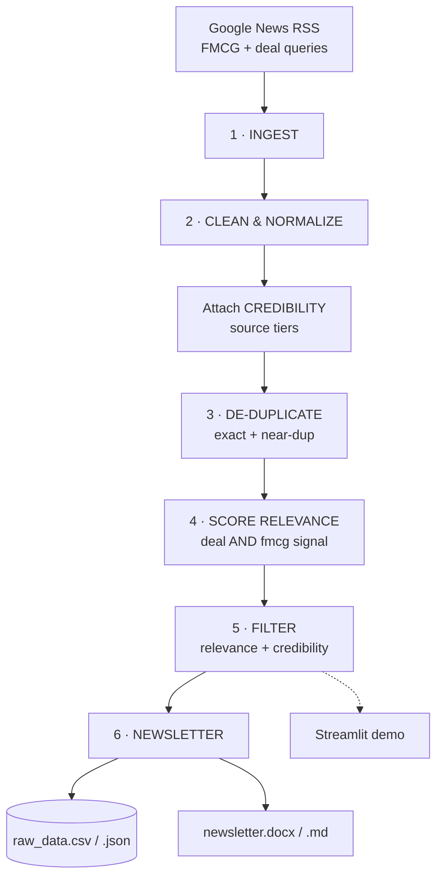

# 📰 FMCG Deal Pulse

**A minimal, transparent "agent" pipeline that turns public news into a concise FMCG M&A & investment newsletter — in real time, with no API keys.**

It aggregates deal-related news on Fast-Moving Consumer Goods (food, beverages, personal care, household, wellness, pet care), removes duplicates and near-duplicates, filters for genuine FMCG-deal relevance, scores source credibility, and outputs a short, structured newsletter a business user can skim — plus the raw data behind it.

> Built for the FMCG deal-intelligence assignment. Live demo, source code, raw data, and the newsletter are all included.

---

## 🔗 Links

| Deliverable | Link |
|---|---|
| **Live demo (Streamlit)** | _add your Streamlit Cloud URL after deploy — see [DEPLOY.md](DEPLOY.md)_ |
| **Source code (GitHub)** | _add your GitHub repo URL_ |
| **Architecture diagram** | [`docs/architecture.svg`](docs/architecture.svg) · [`docs/architecture.mmd`](docs/architecture.mmd) |
| **Sample newsletter (Word)** | [`data/outputs/newsletter.docx`](data/outputs/newsletter.docx) |
| **Raw data** | [`data/outputs/raw_data.csv`](data/outputs/raw_data.csv) · [`data/outputs/raw_data.json`](data/outputs/raw_data.json) |

---

## 🏗️ Architecture




---

## 🧠 Pipeline / "agent" thinking

The system is a clean, inspectable pipeline — `ingest → clean → score → newsletter` — where each stage does one job and writes evidence into the data so the next stage (and a human) can see *why* something was kept or dropped.

### 1. Ingestion (`pipeline/ingest.py`)
Pulls headlines from **Google News RSS** — keyless and free — across a dozen FMCG + deal-language queries (`config.GOOGLE_NEWS_QUERIES`), with an optional hook for extra trade-press RSS feeds. A recency window (default 45 days) keeps the briefing current. If the network is unavailable (e.g. an offline grader), it falls back to a bundled real-deal seed dataset so the pipeline always runs end-to-end.

### 2. Clean & normalize (`pipeline/clean.py`)
Strips the `" - Publisher"` suffix Google News appends, resolves the publisher and domain, and attaches a credibility score.

### 3. De-duplication (`pipeline/clean.py`) — **how it works**
Syndicated and rewritten stories are the biggest source of noise. Two stages:

- **Exact:** identical normalized URL or title → drop the later copy.
- **Near-duplicate:** two stories are merged if **either**
  1. their normalized titles are similar enough — `max(token-Jaccard, sequence-ratio) ≥ 0.72`, **or**
  2. they share **≥ 2 key entities** (acquirer + target). Entities come from a known-FMCG-company list (alias-aware, so *HUL* = *Hindustan Unilever*) plus proper nouns in the headline.

Rule (2) is the important one: real duplicate headlines are often worded very differently (*"Mars completes $36bn acquisition of Kellanova"* vs *"Mars closes Kellanova deal in snacking megadeal"*) — too different for pure string similarity, but they reliably share the **same two companies**. Within each duplicate cluster the **highest-credibility copy is kept**, and the rest become a **corroboration count** (a small reliability signal surfaced in the output).

### 4. Relevance scoring (`pipeline/relevance.py`) — **how it works**
Each article must carry **both**:
- a **deal signal** — *acquire / merger / stake / buyout / divest / invests …* (weighted), **and**
- an **FMCG signal** — a sector term (*food, beverage, personal care, CPG …*) **or** a named FMCG company.

This **AND-gate** is the core filter: a tech acquisition (deal but no FMCG) or an FMCG demand-outlook piece (FMCG but no deal) is dropped. A 0–100 score combines the weighted signal counts; an article qualifies if it clears the threshold **or** names a recognized FMCG major doing a deal (a sound business rule — a known major + a deal action is, in practice, a real sector deal). The stage also extracts, best-effort, the **acquirer, target, deal value, and category**.

### 5. Filter & credibility (`pipeline/credibility.py`)
Transparent source tiers, each with a human-readable reason:

| Tier | Score | Examples |
|---|---|---|
| Wire / financial / primary filings | **1.00** | Reuters, Bloomberg, FT, WSJ, SEC, company newswires |
| Established trade press | **0.75** | FoodBev, FoodDive, WWD, BeautyMatter, Inc42 |
| General / regional outlets | **0.50** | regional dailies, aggregators |
| Unrecognized | **0.40** | cautious default — unverified, not assumed wrong |

The newsletter includes sources at or above the credibility floor; the **raw export keeps everything** (including rejected items) so reviewers can audit the filtering.

### 6. Newsletter (`pipeline/newsletter.py`)
Builds a scannable briefing — headline stats and pipeline funnel → ranked top deals (with value, source, credibility, corroboration) → category breakdown → **methodology & assumptions footer** — exported to **Word (.docx)** and Markdown.

---

## 📦 What the pipeline produces (sample run)

On the bundled real-deal dataset (28 items → with 5 deliberate duplicates and 3 off-topic noise items):

```
Ingested          : 28
After de-dup      : 25   (3 duplicates merged — Mars×3→1, HUL×2→1)
Relevant          : 22   (3 noise items filtered: a tech M&A, an auto story, a no-deal outlook)
Credible + relevant: 22  from 16 sources
```

See [`data/outputs/`](data/outputs/) for `newsletter.docx`, `newsletter.md`, `raw_data.csv`, and `raw_data.json`.

---

## 🚀 Run it

### Locally
```bash
git clone <your-repo-url>
cd fmcg-deal-intel
pip install -r requirements.txt

# Run the demo app
streamlit run app.py

# Or run the pipeline headless and write outputs to data/outputs/
python -m pipeline.run            # live news (falls back to seed if offline)
python -m pipeline.run --offline  # use the bundled seed dataset only
```

### Deploy the demo (free)
Streamlit Community Cloud — full steps in **[DEPLOY.md](DEPLOY.md)**.

---

## 🗂️ Repository layout
```
fmcg-deal-intel/
├── app.py                     # Streamlit demo app
├── pipeline/
│   ├── config.py              # queries, keywords, source tiers, thresholds
│   ├── ingest.py              # Google News RSS ingestion + recency filter
│   ├── clean.py               # normalize + exact/near-duplicate removal
│   ├── credibility.py         # source-tier credibility scoring
│   ├── relevance.py           # FMCG-deal relevance scoring + fact extraction
│   ├── newsletter.py          # Markdown + Word newsletter builders
│   └── run.py                 # orchestrator → CSV/JSON/DOCX/MD outputs
├── data/
│   ├── sample_articles.json   # bundled real-deal seed (offline fallback)
│   └── outputs/               # generated raw_data + newsletter
├── docs/
│   ├── architecture.svg       # architecture diagram
│   └── architecture.mmd       # editable Mermaid source
├── requirements.txt
├── DEPLOY.md
└── README.md
```

---

## ⚖️ Transparent assumptions & limitations
- Headlines / RSS summaries are taken as accurate; the tool surfaces and ranks, it does not fact-check claims.
- **Deal value and parties are best-effort regex extractions** — verify against the linked source before any decision.
- Source tiers are an editorial judgment encoded in `config.py` and are meant to be tuned to your house view.
- Google News RSS coverage and recency drive freshness; widen `GOOGLE_NEWS_QUERIES` or add trade RSS feeds for more depth.
- This is a decision-support draft generator — **review before distribution.**

## 📄 License
MIT — see [LICENSE](LICENSE).
